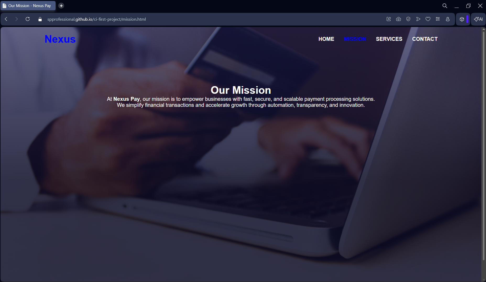

# NexusPay – Static Website

NexusPay is a static website designed to showcase a fintech payment solution. The project demonstrates front-end development fundamentals using HTML5 and CSS3, with a simple design that is legible.

This project was created as part of an online diploma course.

# Features

Four function pages;
 Home
 Mission
 Services
 Contact

  Responsive navigation menu across the site
  A hero section designed 
  A simple interface for easy usability
  Reusable stylesheet for consistent visuals
  Deployed with GitHub Pages

# Live Demo

Live Website: https://spprofessional.github.io/ci-first-project/

# Project Screenshots

The following screenshots demonstrate the completed website and show how the final implementation aligns with the defined user stories and acceptance criteria.

 ! Home Page 

  User Story: View Homepage

Users can access the homepage to view an overview of the business and navigate to other sections of the site.

 ! Mission Page 

  User Story: View Company Mission

Users can view the company mission statement to understand the purpose and values of the organisation.

 ! Services Page 

  User Story: View Available Services

Users can browse the services offered and understand what solutions are available.

! Contact Page 
 
 User Story: Contact the Business

Users can access contact information and submit enquiries using the contact page.

--

# Manual Testing

Manual testing was conducted to assess the functionality, usability, responsiveness, and cross-browser compatibility of the website. The tests were performed on the deployed GitHub Pages version to ensure the live site matches the development version.

| Test ID | Feature Tested | Test Steps | Expected Result | Actual Result | Pass/Fail |
|---------|----------------|------------|-----------------|---------------|-----------|
| T1 | Navigation Links | Click each link in the navbar | Each page loads correctly | All links navigated to correct pages | Pass |
| T2 | Homepage Layout | Open homepage on desktop | Page content is visible, properly aligned, and styled | Layout displayed correctly | Pass |
| T3 | Responsive Design | Resize browser to mobile (375px) | Layout adapts and remains readable | Layout adapts properly | Pass |
| T4 | Services Page Content | Scroll through Services page | All sections display correctly and consistently | Content displayed correctly | Pass |
| T5 | Contact Page Form | Open contact page and check form | Form fields visible and aligned | Form displayed correctly | Pass |
| T6 | Cross-Browser Check | Open site in Chrome and Firefox | Website appears consistent in both browsers | No differences observed | Pass |
| T7 | Image Loading | Open pages with images | All images load without distortion or delay | Images loaded correctly | Pass |

# Testing Summary
All manual tests passed successfully. No critical issues were detected. The live GitHub Pages deployment was also tested and confirmed to match the development version.

 --

# Project Structure

payment-processing-project/
  assets/css/style.css
  assets/images
  assets/screenshots
  index.html
  mission.html
  services.html
  contact.html
  README.md

# Design Overview

The design focuses on;

 Modern minimalism 
 Visual clarity
 Clear branding
 Consistency with spacing and styling
 Simple and legible typography

# Wireframes

The following wireframes outline the project structure for each page.

 ! Homepage Wireframe

|  NAV BAR
|  [Home] [Mission] [Services] [Contact]

|                    HERO SECTION                      |

|      |     Title                              |      |
|      |     Short introduction                 |      |
|      |     [ Call To Action Button ]          |      |

|                FEATURE / HIGHLIGHT SECTION           |
|           [Card 1]     [Card 2]     [Card 3]         |

|                    FOOTER                            |

 ! Mission Page Wireframe

|  NAV BAR                                             |

|                      MISSION                         |

|   | Large header                                   | |
|   | Paragraph(s) describing the mission/goal       | |

|     Potential images / content                       |

|                    FOOTER                            |

 ! Services Page Wireframe

|  NAV BAR                                             |

|                     SERVICES                         |

|  | Card 1: Title                                  |  |
|  | Short description and action button            |  |

|  | Card 2: Title                                  |  |
|  | Short description and action button            |  |

|  | Card 3: Title                                  |  |
|  | Short description and action button            |  |

|                    FOOTER                            |

 ! Contact Page Wireframe

|  NAV BAR                                             |

|                      CONTACT                         |

|   | Name Input                                     | |
|   | Email Input                                    | |
|   | Message Text                                   | |
|   | [Submit Button]                                | |

|         Social Icons / Contact links                 |

|                    FOOTER                            |

! Attributions

This project uses:
- Ionicons for social media icons
  - https://ionic.io/ionicons

- AI Generated Image due to copyright restrictions this image as generated by an AI Module. (ChatGPT)

- The built in AI assist in VSCode also contributed but the code is my own creation.

All other HTML and CSS were created independantly.

# Version Control

This project uses;

 Git for version control
 GitHub for repository hosting
 GitHub Pages for deployment

# Deployment

Deployment is handled via GitHub Pages.

To redeploy:
1. Push updates to the `main` branch
2. GitHub Pages rebuilds automatically
3. View at: https://spprofessional.github.io/payment-processing-project/

# License

This project is for educational and portfolio use.

# Further Enhancements

This project has potential to be built upon, adding additional features such as; 

 Transaction History, User Authentication, Multiple Payment Options, Admin Panel and more

 The content could also be further refined but I was focused on a minimalist approach that was within the guidelines rather than hyperfixating on a true polished website with meaningless content.